# DCS Air Race Script
This script is for DCS World mission creators who want to create epic race courses easily.  
Scroll down for the full documentation.

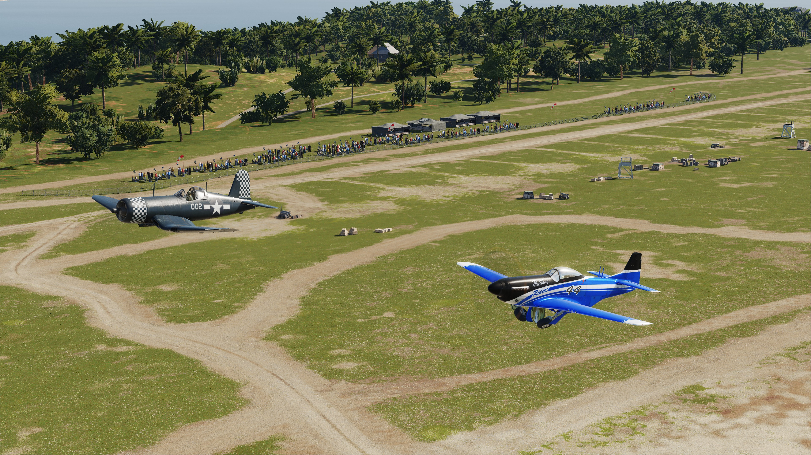
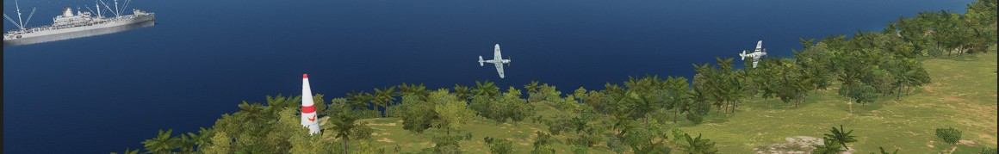   
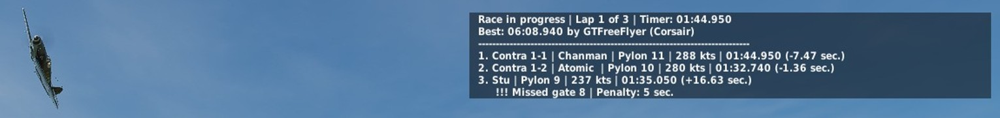
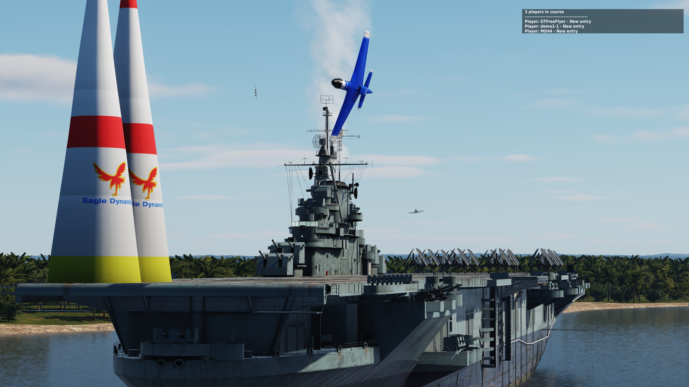

Why choose this fork by GTFreeFlyer?  
If you noticed, this repository is a fork from the original "Joe Kurr" script posted by basman. This project has evolved MUCH further from the original, from nearly 700 lines of code to now 2600. The original stuff is in here, but this project has grown tremendously in size and scope, including full documentation as you'll see below.  It is feature-rich with almost everything you could ever want for an air race. Have more ideas? Send them over!  
 Cheers!  
 -GT-
 
This README was created by GTFreeFlyer. You may find me on Discord or the ED Forums with the same username if you have questions or comments. My Discord profile has a link to GT's Runway where you can engage in discussion, and receive update notices, regarding any of my content produced.
## Table of Contents
* [Features](#features)
* [Download and Installation](#download-and-installation) 
* [Creating a Race in the Mission Editor](#creating-a-race-in-the-mission-editor)
   * [First Steps](#first-steps)
   * [Set Up the Required Triggers](#set-up-the-required-triggers)  
   * [Design Your Race Course](#design-your-race-course)
   * [Setup Required for Group Races](#setup-required-for-group-races)
   * [Using an AI Pace Plane](#using-an-ai-pace-plane-in-your-group-race)
* [Race Settings](#race-settings)
   * [Required Settings](#required-settings)
   * [Optional Settings](#optional-settings-you-can-delete-them-entirely-if-you-like-the-default-values)
   * [Penalty and DNF Settings](#penalty-and-dnf-settings)
   * [Group Race Settings](#group-race-settings)
   * [Night Race Illumination Settings](#night-race-illumination-settings)
* [General Purpose Flags for Mission Creators](#general-purpose-flags-for-mission-creators)
* [Contact Info](#contact-info)
* [Forum Thread](#forum-thread)
* [Example Missions Included](#example-missions-included)
* [Credits](#credits)

## Features
* Set up an air race track with little effort, and track timing and violations of participating pilots.
* Persistent data saving makes sure your best times and race lines are saved, then recalled next time you open the mission.  
* Supports individual racing (everyone has their own timer), or group racing (everyone shares a common timer) with or without a pace plane.  
* Information display for keeping track of your progress as well as the competition's.  
* Group races have a dynamic leaderboard display that changes as players overtake each other.  
* Your trail history (race line) is plotted on the F10 map after the race, for post-race review.
   * Different colors for each player
   * Different line styles per lap
   * Label next to the line with player's name and aircraft type in same color
* F10 radio menu categories for keeping an eye on the competition:  
   * Top 10 Racers (no repeated names)
   * Top 10 Total Times (names may be repeated)
   * Top 10 Racer Laps (no repeated names)
   * Top 10 Lap Times (names may be repeated)
* Define the number of laps for your race.
* Detects pylon hits, missed gates, entry into restriced zones, etc.
   * Define how many of each result in a DNF
   * Restricted zones trigger an immediate DNF
* Define the height of your gates using a global value, or individual gate values. Gates can also be "floating" in the air.
* Define an altitude band within all gates globally, or individually, that will provide a bonus time reduction. 
   * Great for bridges, buildings, etc.  
* Define the ceiling of your race airspace. 
* Enforce the airspace around the race course during group races. Non-participants will explode if they enter. 
* Gates can have wings-level, knife-edge, or inverted flight requirement.  
* Night racing is possible with automatic lighting of the course at each gate, and also at any additional location marked by a trigger zone with name "illum".  
* Fireworks (signal flares) when planes cross the start or finish lines. They originate from wherever you drop a trigger zone with name "fireworks".  
* Easy to add colored smoke markers that automatically refresh, simply by dropping a trigger zone on the map where you want them. You specify the color of the smoke in the naming of the trigger zone.  
* Many general-purpose flags, based on events in the race, are available for the mission creator to use for whatever creative purpose he/she can come up with.  
* Option to automatically draw lines between the gates and place labels on the F10 map. This jagged line will be replaced and kept updated by the best race line recorded.

  
## Download and Installation  
Source: https://github.com/GTFreeFlyer/DCSAirRaceScript/  
   * Please click the Watch button and Star button at the top of the GitHub page to receive notices when there are updates.  
   * Please click Issues at the top of the GitHub page to report bugs and request new features.  
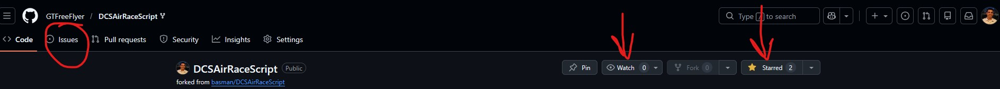
1. From the GitHub page, click Releases on the right side, and click DCSAirRaceScript.v4.zip to download it. (You do not need to download the Source code zip or tar.gz).    
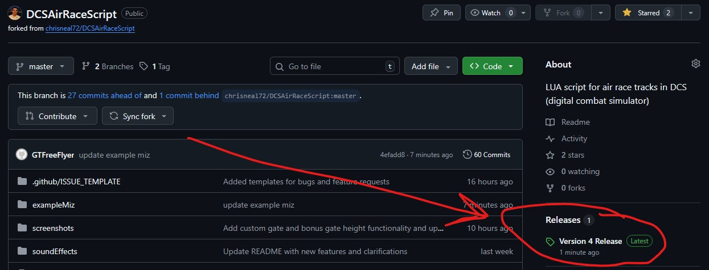
2. Extract the .zip anywhere you like on your PC
3. If you don't already have MIST downloaded to your PC, get it from https://github.com/mrSkortch/MissionScriptingTools. You only need the single file, mist.lua.  There's no need to download the whole .zip from here. Click on mist.lua from the list of files you see; this will bring you to the page that shows all 9500+ lines of code.  Press ctrl+shift+S to save the file somewhere on your PC.
  
## Creating a Race in the Mission Editor

### First Steps:
   * Before loading scripts, triggers, creating zones, etc., I HIGHLY recommend figuring out where your race course will be. Do some scouting for cool locations, and then place static objects where the turns and gates will be (I recommend Static object -> category Structures -> Type Airshow cone).  

   * You want to do that first, and then test fly the track with a test plane to make sure it flows well, turns aren't too crazy, etc.  You want it to be fun, creative, and replayable. Tips: Use nearby terrain, buildings, bridges, coastlines, etc. The possibilities are endless!

   * Once you have it figured out, continue below. The reason is simple: It's much easier to make changes now, moving pylons around, rather than later where changes will require much more work (i.e. moving the pylons, triggerzones, labels, etc.)

   * Optional, but recommended: To be able to read/write your data so that the best times and race lines are recalled whenever the mission loads, you must desanitize your lua environment, done easily: 
      * Go to your DCS root install folder (NOT YOUR SAVED GAMES FOLDER!)\Scripts\MissionScripting.lua, and add a double dash (--) in front of these two lines to comment them out:
      * --sanitizeModule('io')
      * --sanitizeModule('lfs')
      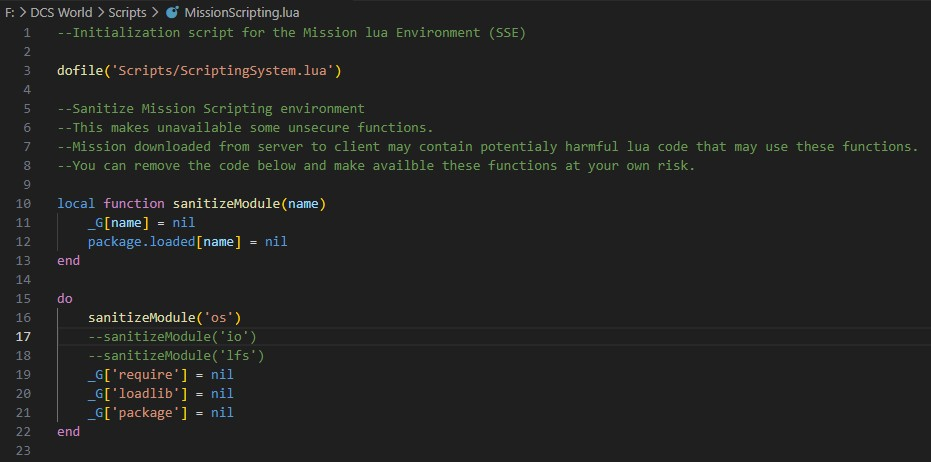  
      * If running a dedicated server, you must do the same in its install folder.  
      * You must repeat this after any DCS update, as it will reset this file.  
      * DCS may required a restart after this to make sure it takes effect.  
      * Disclaimer: This allows lua scripts to read and write to your PC! Just be careful and make sure you trust any other script you use. There's no need to worry with the race script as the source code is right here for you to see. Everything is kosher here.    
   * Okay, go get started. I'll see you back here shortly. Good luck! 

### Set Up the Required Triggers:  
1. Start with a blank template, name your .miz and save it. The tutorial below will be saved as GTFreeFlyersRaceTutorial.miz and is included in the .zip you downloaded earlier. It's on the Marianas WWII map.   

2. Minimize DCS and go to the extracted .zip folder.  
Open "Example Settings without Explanations.txt".  
Hit CTRL+A to select all text, and CTRL+C to copy it to your clipboard.  

3. Create the first trigger in your DCS mission:  
TYPE: MISSION START, NAME: Race Settings  
CONDITIONS: none (leave empty)  
ACTIONS: DO SCRIPT, and then click in the text box and hit CTRL+V to paste all the settings. Don't bother changing them now. We'll come back to this and explain everything in there after you have designed your race course. Just move on for now...  
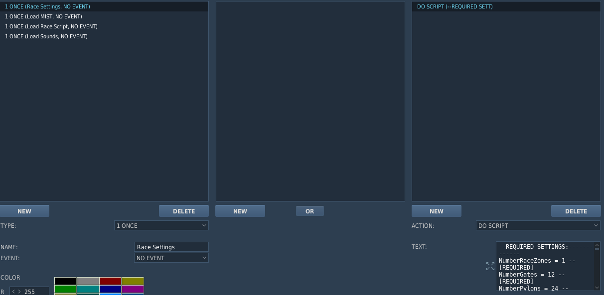  

4. Create the 2nd trigger:  
TYPE: ONCE, NAME: Load MIST  
CONDITIONS: TIME MORE, 1 second  
ACTIONS: DO SCRIPT FILE - Navigate to where you saved mist.lua and select it.  

5. Create the 3rd trigger:  
TYPE: ONCE, NAME: Load Race Script 
CONDITIONS: TIME MORE, 2 seconds  
ACTIONS: DO SCRIPT FILE - Navigate to the extracted DCSAirRaceScript folder and select AirRaceScript4.lua (or whatever the latest version number is).  
You do not need to open or edit the .lua file. Just load it into the mission and we'll set everything up AFTER we are finished designing the race course.

6. Create the 4th trigger:  
TYPE: ONCE, NAME: Load Sounds  
CONDITIONS: FLAG EQUALS, Flag: 999, Value: 999 (we are creating a flag that will never execute, just to load the sounds into the .miz)  
ACTIONS: SOUND TO ALL - Navigate to the extracted DCSAirRaceScript folder and select one of the .ogg files from soundEffects/required folder. Create another action and select another .ogg from that folder. Repeat until all .ogg files are loaded.  

   Note: This 4th trigger is actually optional. You may decide not to use these sounds if they interfere with other sounds you load into your mission.
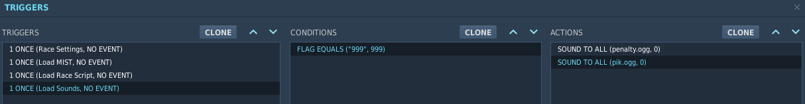  
  
### Design Your Race Course:
7. Create the first gate by placing a trigger zone named "gate-1".  
      * Note: All trigger zone names mentioned in this tutorial are case-sensitive, so type them exactly as shown.  
      * All trigger zones must start with number 1 and increment by 1 at a time. No leading zeroes. Do not skip numbers.  
      * Caution: Placing anything (zones, static objects, etc.) in areas with lots of terrain fluctuations (mountains, rolling hills, etc.) may produce strange results when evaluating your altitude at the gate. This is a DCS limitation with how terrain elevations are returned to us via their scripting function. When trying to pull the terrain elevation under the exact spot of your plane, DCS might give something that seems off. Possibly a terrain mesh vs. visualization thing. I really don't know. This is evident as sometimes when you place a static object there, they won't show up. They're probably underground. If you move them slightly, even just a few feet, they will likely show up. Yeah, strange stuff and we can't do much about it.  

8. You want your racers to know where these trigger zones are, so place any object you like on either side of the zone, or just one one side of the zone if you prefer it that way.  
      * Make sure these object are INSIDE of the gate zone, so that you'll be able to detect pylon hits.  
      * These objects have nothing to do with the script and you can do whatever you like with them.  
      * I recommend Static object -> category Structures -> Type Airshow cone
      * Tip: If you plan to use Tacview to debrief your race, place an infantry or vehicle at (or inside) each pylon so that the pylon location is visible in Tacview.  

9. In the example screenshot below, I've placed two groups of three cones to indicate the starting line. Racers will enter East to West. I recommend using a rectangular shaped zone for the start and finish lines so that you have a nice straight line for fairness.  The script checks position every 0.2 seconds (adjustable), so do some math to figure out how far your plane travels in that amount of time, and make sure the trigger zone is long enough to ensure detection. For example, if you expect to enter the race at Mach 1 (1125 ft/sec), you'll travel 225 ft in 0.2 seconds, so I'd suggest a trigger zone around 300 feet in length.  
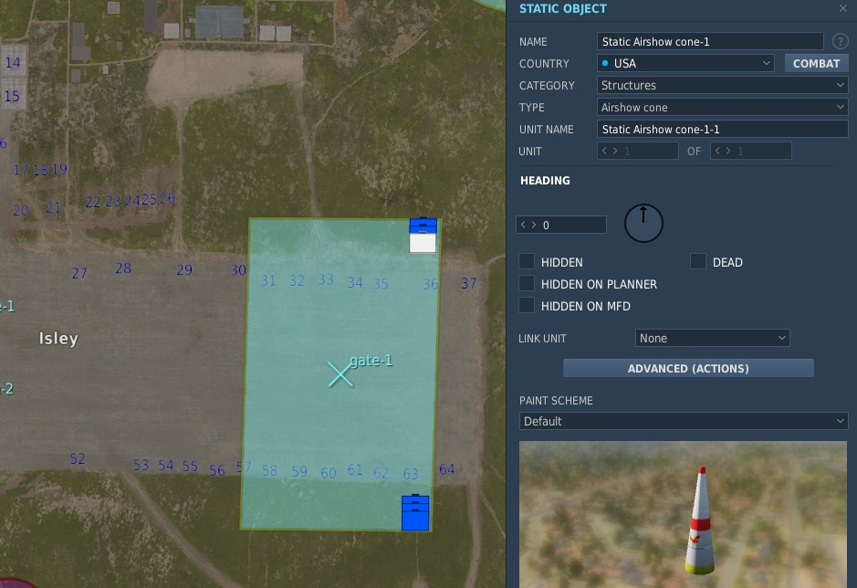  

10. Now place trigger zones over the pylons and name them "pylon-1", "pylon-2", and so on. This is optional, only if you want to assign penalties for hitting pylons.
      * Again, make sure the pylons and their zones are located just INSIDE the edges of the gate zone. If they are outside, then a pylon hit might not get registered, and if it does, you'll receive a penalty for a pylon hit AND another penalty for a missed gate. Keep them just inside the gate zones so that you only get the pylon hit penalty and receive credit for passing through the gate.    
      * If you copy and paste pylon-1 triggerzone, it will automatically rename it to pylon-2, and so on.  
      * Due to their small size, depending on what you use as a pylon, it is very possible that fast moving aircraft may fly completely through the pylon zones before detection, so just be aware of this.
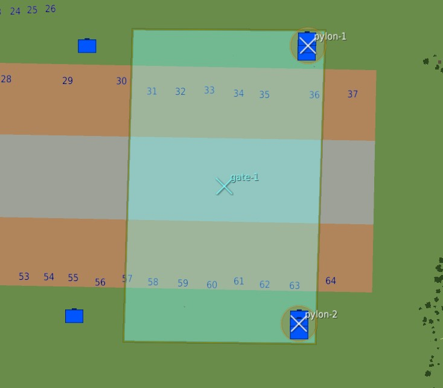  

11. Let's add more gates now. We'll keep the course small for this tutorial, perhaps good for helicopters?  
      * When adding gate zones, you must always start with gate-1, then gate-2, gate-3, etc.  
      * The course does NOT have to end where it starts. You can do a race from gate-1 to the last gate if you wish. This is defined in the Race Settings. More on that later.
      * Do not add leading zeroes, and do not skip any numbers.  
      * Gate trigger zones must be numbered in the order you plan to fly through them.  
      * Pylon zone numbering must follow the same naming rules, but they can be placed in any order (i.e. you can have pylon-4 near gate-1, and pylon-1 near gate-3).  
      * Don't forget to add your static objects for the pilots to know where to go!
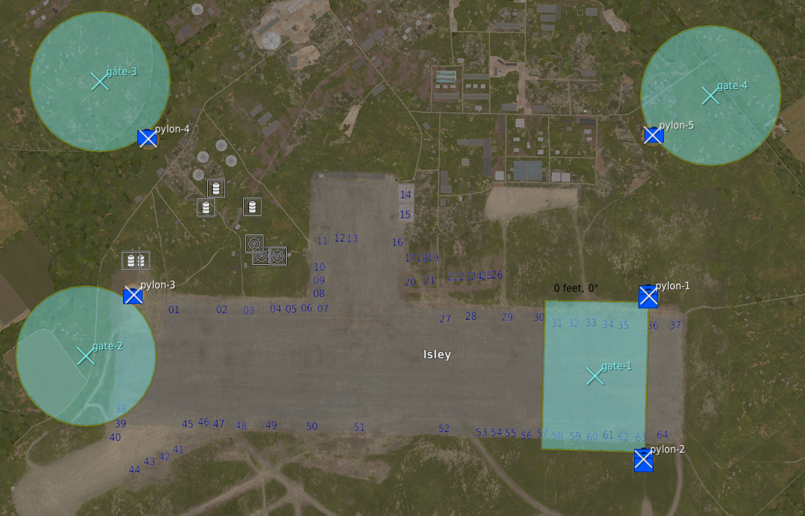  

12. We must now define the racing zone that will detect players and add them to the race.  Players outside of this zone will be removed from the race, and their names will not clog up the display in the list of active racers on your screen while racing.  
      * A single trigger zone over the whole course is sufficient. Name it "racezone-1".  
      * If you have a long and skinny course, you can get more creative and define the race area with multiple zones as seen in the second screenshot below.  Try to minimize the number of race zones to reduce the processing overhead of the script.  
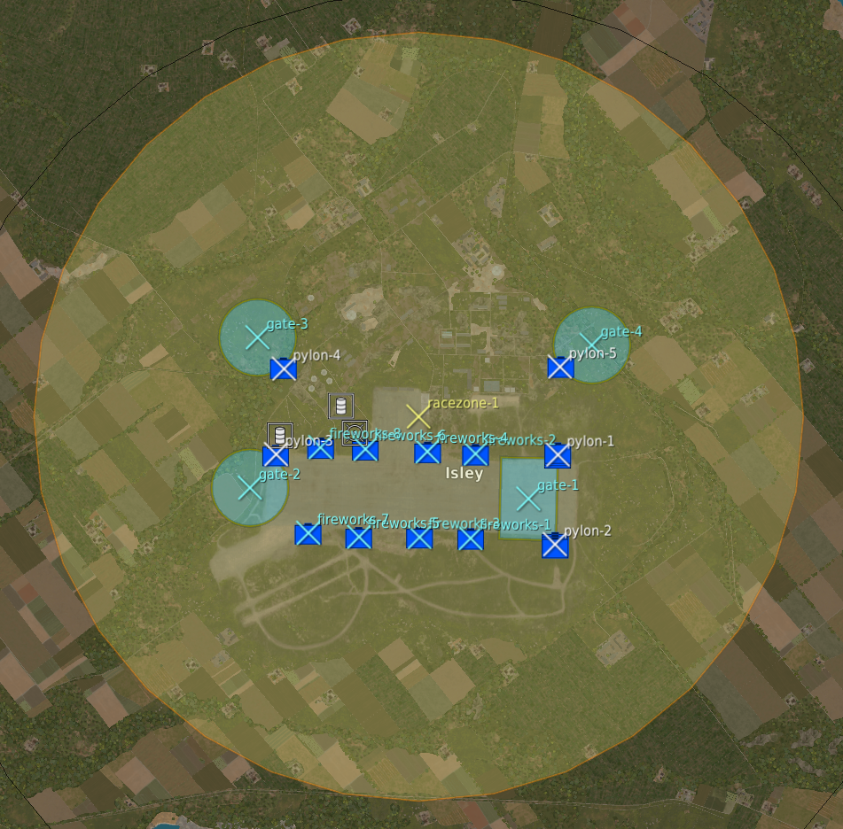  
or...  
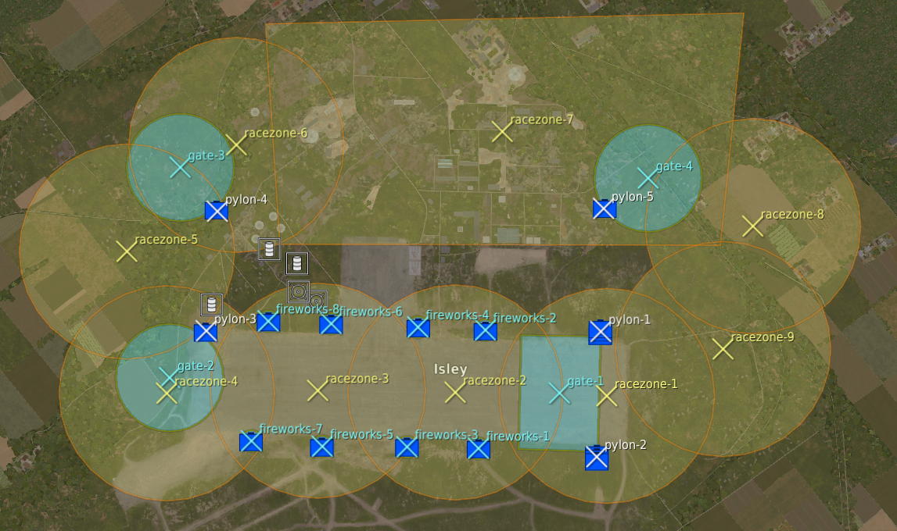  

13. Place your desired airplanes into the mission as usual. This is a basic editor skill and not covered in this tutorial.  
      * You can place as many normal or dynamic spawns as you like, and name them whatever you want. The script will detect any human-controlled aircraft in the race zone.  
      * Note: If you place them at the airfield shown in this tutorial, they will be immediately entered into the race, and if you happen to takeoff through gate-1, the race will start! You can place them at a nearby airfield, or air start, as desired.  

14. Create a detailed briefing that explains how the race works so others know what to do. One of my biggest pet peeves in DCS is missions that don't give you any information. I've made this simple for you. Open "Example Mission Briefing.txt" from the extracted .zip, copy and paste the info into the mission briefing, and tweak it to match your mission setup. You can even go above and beyond and draw on the map...
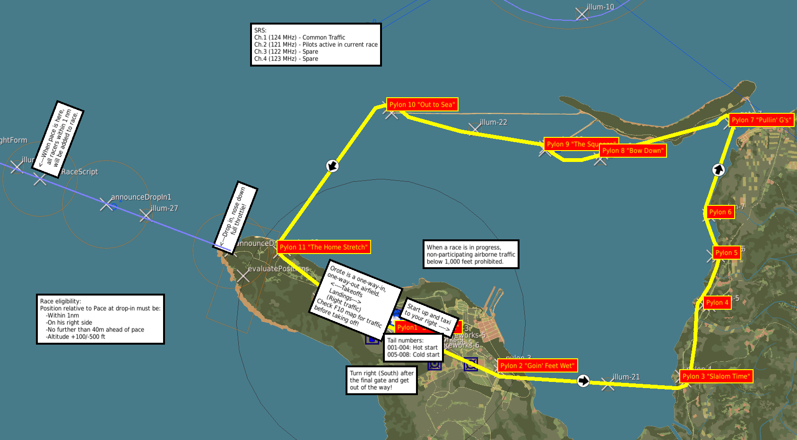
  
Okay, that covers all the required stuff, but wait!... There are more (optional) goodies below, and we still need to go back to the Race Settings. More on that in a later section below.

15. Let's get fancy and add some fireworks effects! Fireworks (signal flares) will pop up from trigger zones names "fireworks-1" and so on.  
      * The size of the zone is irrelevant. Only the center point is used.  
      * They fire off whenever any racer crosses the starting line (solo racing), the first racer crosses the starting line (group racing), or when any aircraft crosses the finish line.
      * If you want them to only appear after the starting line is crossed, use trigger zone names "fireworks-start-1" and so on.  
      * If you want them to only appear after the finish line is crossed, use trigger zone names "fireworks-end-1" and so on.  
      * Fireworks originate 1 meter above the ground.  
      * Optional: I suggest placing a static object, such as an M92 Oil Barrel, at the location so you don't see the fireworks coming from nowhere.  
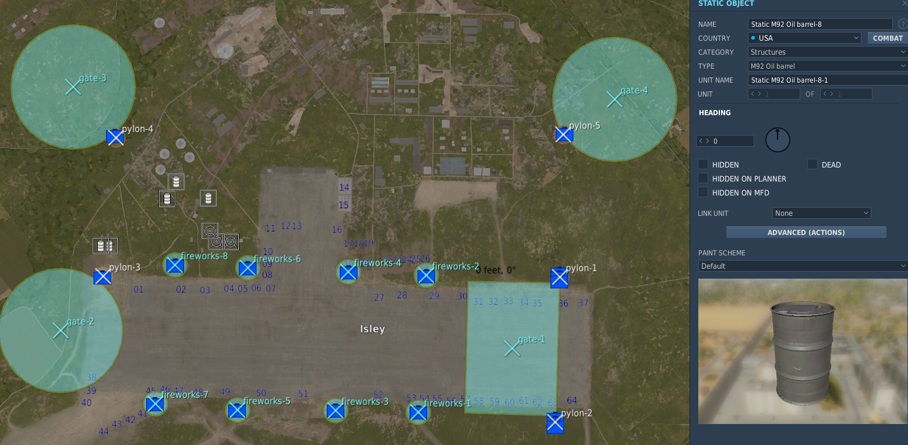

16. Interested in night racing? It's wild!  
      * The script will automatically light up the course with illumination flares above every gate trigger zone.  
      * Want additional lighting? Easy! Place trigger zones named "illum-1", "illum-2", and so on.  
      * The size of the zone is irrelevant. Only the center point is used.    
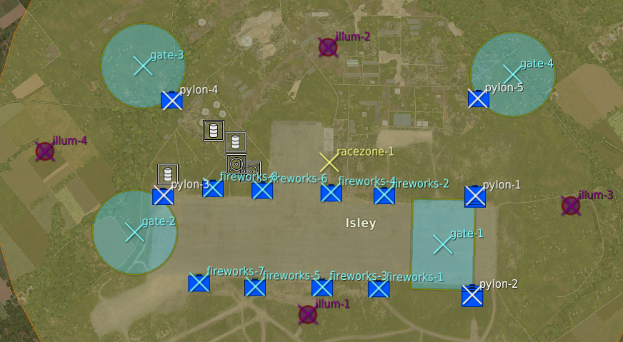  
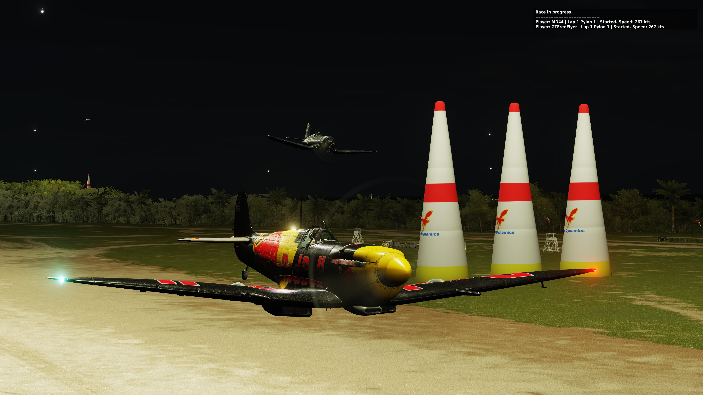  
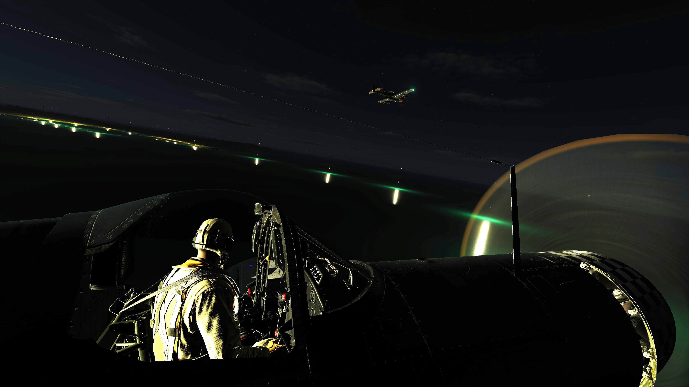

17. Need to add smoke markers? Just drop a trigger zone name "Green smoke-1", "Green smoke-2", and so on.  
      * Color choices are Green, Blue, White, Orange and Red.  
      * The numbering is per color. For example: "Green smoke-1", "Green smoke-2", "Blue smoke-1", "Green smoke-3", "Red smoke-1", etc.  Simply start with -1 for each color you want, then copy and paste the trigger zones and they should automatically be named appropriately.  
      * As always, no leading zeroes, and don't skip numbers!  
      * The script will automatically create the smoke at these trigger zones AND keep them refreshed every 5 minutes.  
      * The size of the zone is irrelevant. Only the center point is used.  
      * In the example below, I placed the different colors along either side of the runway.  
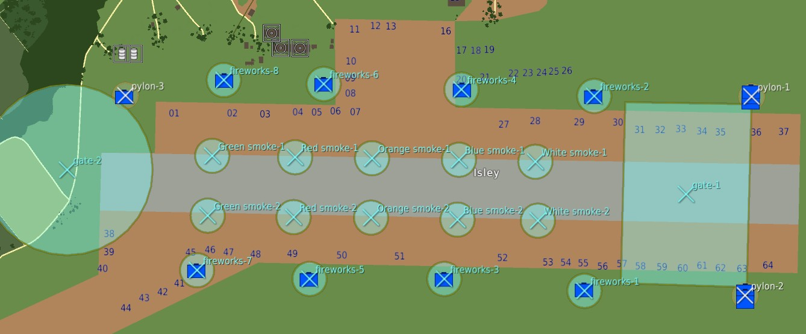
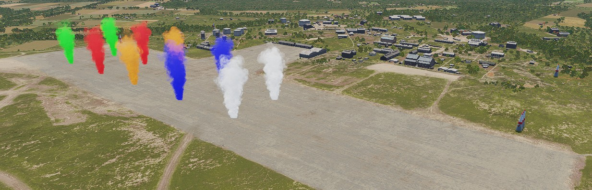  

18. Need to protect certain areas of the course? You can trigger an immediate DNF (Did Not Finish) on a player that enters any zone named "DNF-1", "DNF-2", and so on.

  
### Setup Required for Group Races:
Group races are loads of fun when coordinated properly between a group of friends, or when using an AI pace plane (more on this later below). The timer will start for everyone as soon as the first racer crosses the starting line. You can communicate with each other over voice chat to get everyone into a line-abreast formation, then call 3-2-1-Go! The group race option is set in the Race Settings. One neat feature with group racing is that the standings display in the upper-right of your screen is dynamic, meaning you'll see yourself moving up and down the list if you are gaining or falling back on the competition.  

IMPORTANT: When the group race option is selected, the race script will load at mission start, but WILL NOT run, unlike individual racing. You will need to force it to run by executing a trigger action DO SCRIPT, and the only thing you type into the text box is, startRaceScript()  

You may want to place a trigger zone ahead of the gate, definitely ahead of the PaceDrop triggerzone mentioned later, and within the racezone, that will kick off this script and make it run and look for players. The reason for this is because you will not want to add players to the race if they are not in formation with - or almost in formation with - the pace plane prior to gate-1 entry.  In the example below, you can see we are entering East to West, and we ensure we hit the "start race script" trigger zone (you can name it anything you like).

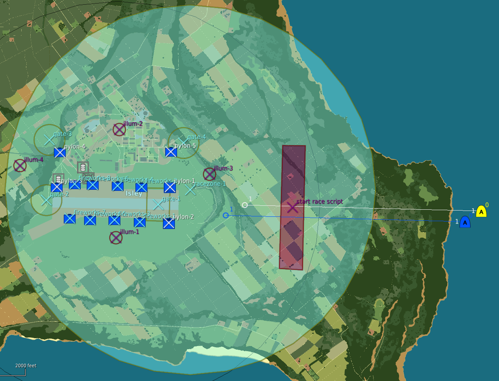  

And in the next screenshot, I decided to make the trigger a SWITCHED CONDITION, so that after the race completes, we can just come back around and start the script again.  

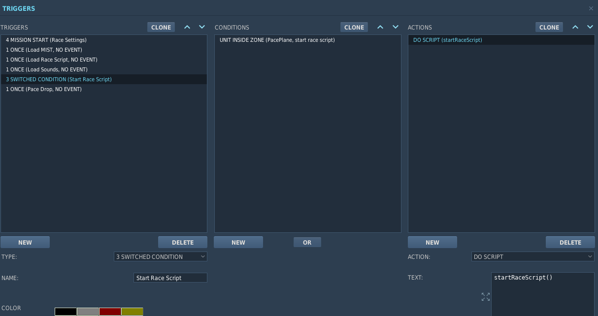

### Using an AI Pace Plane in Your Group Race:
You can use an AI Pace Plane in the mission that flies a predetermined path towards gate-1, and create your own triggers and voiceovers to keep everyone coordinated.  The moment the pace plane releases everyone to go full-throttle and begin the race is referred to as the "drop-in". The drop-in usually occurs 10-20 seconds before the group reaches gate-1.  

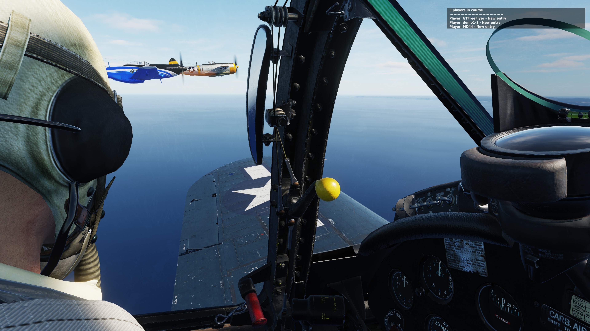

If you are going to set up an AI pace plane, you need to place a trigger zone at the very moment the pace plane drops in. A trigger must be set up with a CONDITION to detect when the pace plane is inside this trigger zone, and the ACTION must be FLAG ON for a flag named "PaceDrop" (case-sensitive).  

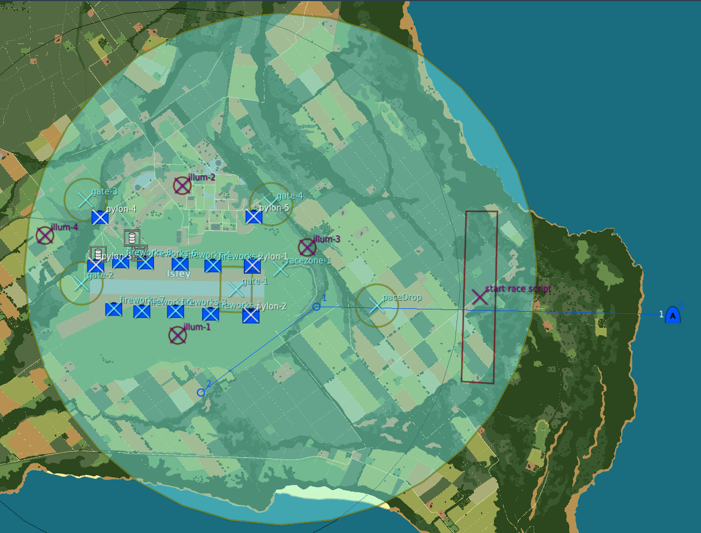
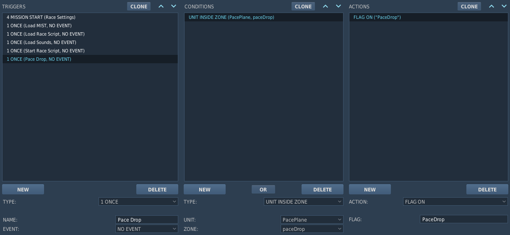  

At this moment of drop-in, everyone's position relative to the pace place will be evaluated, and they are accepted into the race if they meet certain criteria: 
   * You must be within 1 nautical mile (tune-able in the Race Settings)  
   * You must not be greater than 40 meters ahead of the pace. (0 to 40 meters will incur penalty time)  
   * You altitide must be within +100/-500 feet (0 to +100 feet will incur penalty time)   
   * You must be on the right side of the pace (everyone right-line-abreast formation)  

You can get creative with the pace plane to make him fly gently around a circuit, and return back to a holding area for the next group of racers.  Please play around with GTFreeFlyers Marianas WWII Races.miz in the exampleMiz folder before attempting to create your first AI Pace Plane race.  

When everyone has completed the race, the script will stop running about 15 seconds later. As mentioned earlier, next time the startRaceScript() trigger is triggered, everything will start running again.  

You can even create F10 radio menu options with triggers to DO SCRIPT startRaceScript(), or DO SCRIPT stopRaceScript() if you prefer your own control over the script.  (Only works for group races)  

## Race Settings  
One of the first steps you did above was create the very first trigger, Race Settings. This is how we set up the mission the way we want it, now that we have finished designing our race course.   

You copied all the contents from "Example Settings without Explanations.txt" into the text box in the first trigger.  You can click the small quad-arrow icon next to the text box to open up an editor. Do that now as you view the example and explanations below.  

Note:  
   * All the optional settings can be omitted if you like the default values.  
   * Values next to optional, i.e. [optional, 30], are the default values the script will use if you choose to omit the setting. Changing the default value here has no effect and is for informational purposes only. 

### Optional Settings: (You can delete them entirely if you like the default values)

DistanceUnits = "m"  
 * [optional, "ft"] units to use for the altitude and distance settings below.  
 * Your two options are "ft" and "m". Make sure to include the quote marks.  

NumberLaps = 3  
   * [optional, 0] total number of laps per race
   * If zero, race ends at last pylon, otherwise race will end at gate-1

NewPlayerCheckInterval = 1  
   * [optional, 1] seconds between checks for new players entering the racezone

RemovePlayerCheckInterval = 20  
   * [optional, 30] seconds between checks for players that have exited the racezone

HorizontalGates = {3,6,9,12}  
   * [optional, {1}] list of gate numbers requiring level flight +/- 10 degrees

VerticalGates = {4,7,11}  
   * [optional, {}] list of gate numbers requiring knife-edge flight +/- 10 degrees  

InvertedGates = {2,5}  
   * [optional, {}] list of gate numbers requiring inverted wings level flight +/- 10 degrees

RaceZoneCeiling = 2000  
   * [optional, 99999] maximum altitude of the racezone. 
   * Planes above this will not be added to the race, or removed if they are. 
   * If you are using a pace plane, make sure this altitude is at least 500 ft (152 m) higher than the drop-in alt.

GateHeight = 150  
   * [optional, 300] global height of the gates for any gate not listed in CustomGateHeights (next setting below). 
   * Racers flying through a gate higher than this will receive a penalty

CustomGateHeights = { gate1={0,500}, gate12={100,400} }  
   * [optional, {}] override the global GateHeight for specific gates. 
   * Must define both the minimum and maximum heights.  
   * The example above will count the gate crossing at gate-1 if you cross between 0 and 500 ft (or m) AGL, and at gate-12 if you cross between 100 and 400 ft (or m) AGL.
   * You can use these overrides at bridges, buildings, "floating" gates, etc.  
   * Add more gates as needed, separated by commas like in the example.  
  
BonusGates = {2, 4}  
   * [optional, {}] list of gate numbers for low altitude bonus

BonusGateHeight = 15  
   * [optional, 20] global height of the bonus gates, for any gate listed in BonusGates and not in CustomBonusGateHeights (next setting below).  
   * Racers flying through a gate below this altitude will get a bonus  
  
CustomBonusGateHeights = { gate1={0,25}, gate11={20,40} }
   * [optional, {}] override the global BonusGateHeight for specific gates.  
   * These gates MUST also be included in BonusGates (two settings above) for this to work.
   * Must define both the minimum and maximum heights.  
   * The example above will give you a bonus at gate-1 if you cross between 0 and 25 ft (or m) AGL, and a bonus at gate-11 if you cross through a tiny sliver between 20 and 40 ft (or m) AGL.  
   * You can use these overrides for bonuses under bridges, thru buildings, etc.
   * Add more gates as needed, separated by commas like in the example.

BonusTime = 2  
   * [optional, 1] time in seconds to subtract when hitting a bonus gate  
  
AutoDraw = false
   * [optional, true] draws lines on the F10 map between the gates and places gate labels.   
   * Set it to false if you intend to make your own map drawings.
   * This jagged line with sharp corners (first screenshot below) will be replaced by the best race line once someone finishes the course (second screenshot below). In the second screenshot, you can also see that your race line is plotted if you did not beat the best time.

   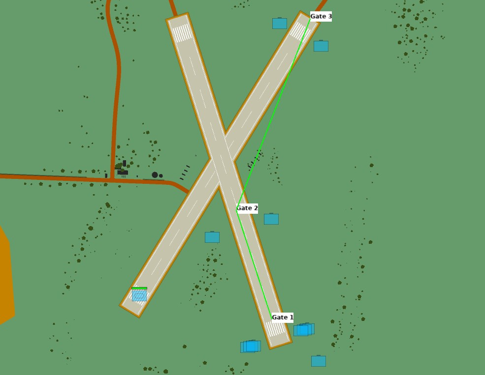  
   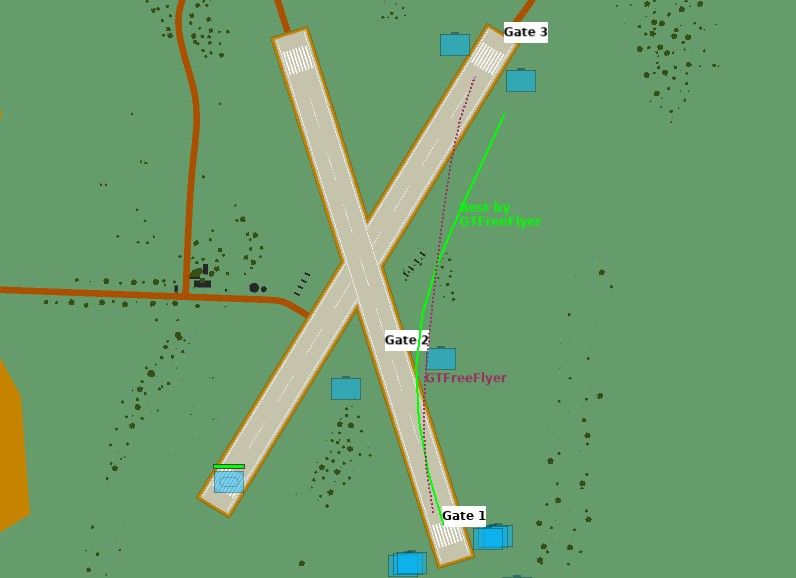  
    
PlotRaceLines = false
   * [optional, true] Choose whether to draw the race lines on the F10 map or not.
   * Recommend leaving true, unless you need to hide racers' lines for competition reasons.
   * The best race line will be plotted as a solid green line representing all laps.
   * All non-best racelines...
      * ...will be plotted as a random color for each player, along with your name and aircraft type label next to the race line, in the same color and at a random spot along the raceline of the first lap.
      * ...will have a different line style for each lap as follows:
         * Lap 1: Dashed - - - - - - - - - - - -
         * Lap 2: Dotted • • • • • • • • • • • 
         * Lap 3: Dot Dash • - • - • - • - • -
         * Lap 4: Long Dash ----- ----- ----- -----
         * Lap 5: Two Dash -- --   -- --   -- --   

SaveFilename = "WarbirdRace" 
   * [optional, "MyRace"] Must place the filename in quotes
   * Avoid using apostrophes or additional quotes in your filename.
   * The save file will be created where your .miz is. !!!DO NOT EDIT!!! this file. You will get script error pop-ups!
   * You will find it in the folder with Data.txt appended to the SaveFilename. For example: WarbirdRaceData.txt
   * To make this work, you must desanitize your lua environment as explained above, in [First Steps](#first-steps)

RaceScriptRefreshTime = 0.1
   * [optional, 0.2] time in seconds between script refresh. Experimental! For developer use to see how fast the script can be pushed. 
   * If you need futher sub-second timing, lower this value at your own risk.
  
### Penalty and DNF Settings:
  
PenaltyTimeMissedGate = 4  
   * [optional, 5] time in seconds added to your race time for each missed gate
   * Valid range: 0 to any positive integer  
  
PenaltyTimePylonHit = 2  
   * [optional, 3] time in seconds added to your race time for each pylon hit
   * Valid range: 0 to any positive integer  
   * Note: Flying directly over a pylon is considered a hit

PenaltyTimeAboveGateHeight = 2  
   * [optional, 2] time in seconds added to your race time each time you hit a race zone above the height limit defined by setting named GateHeight.  
   * Valid range: 0 to any positive integer  

PenaltyTimeHorizontalGate = 1  
   * [optional, 2] time in seconds added to your race time when passing through a horizontal gate zone when wings not level +/- 10 degrees  
   * Valid range: 0 to any positive integer  

PenaltyTimeVerticalGate = 1  
   * [optional, 2] time in seconds added to your race time when passing through a vertical gate zone when wings not knife-edge (90) +/- 10 degrees  
   * Valid range: 0 to any positive integer    

PenaltyInvertedGate = 1  
   * [optional, 2] time in seconds added to your race time when passing through a inverted gate zone when not inverted with wings level +/- 10 degrees  
   * Valid range: 0 to any positive integer  

NumberMissedGatesDNF = 3  
   * [optional, 999] how many missed gates will trigger a DNF
   * Valid range: 1 to infinity  

NumberPylonHitsDNF = 3  
   * [optional, 999] how many pylon hits will trigger a DNF
   * Valid range: 1 to infinity  
  
StartSpeedLimit = 300  
   * [optional, 999] first gate speed limit in knots  
   * Passing the first gate above this speed limit will result in a DNF  

### Group Race Settings:  

GroupRace = true  
   * [optional, false] same timer for all, or individual timers
   * If true, timer starts for all players as soon as the 1st racer crosses the start

GroupRaceTimeout = 30  
   * [optional, 120] minutes after clock starts, or pace drops in.  
   * Offers protection if a racer decides to fly around in the racezone, purposefully starting, but not finishing the race.  
   * Script will stop without warning, and you'll be able to begin the next race.

PaceUnitName = "PacePlane"  
   * [optional, nil]  
   * Pace plane's unit name (pilot name) from the editor. Case-sensitive, placed in quotes "like this".  
   * Used only when GroupRace=true

GroupRaceParticipantFilter = 6000  
   * [optional, 999999] max distance between pilot and pace plane in order for the pilot to be added to the race list before drop-in.  
   * Used only when GroupRace=true, and when a pace plane is added  

GroupRaceEnforceAirspace = true
   * [optional, false] airspace enforcement 
   * If true, non-participants during an active group race will explode if they enter the race zone

### Night Race Illumination Settings  

IlluminationOn = false  
   * [optional, true] true or false whether you want race course lighting at night
   * If true, the illum. flares appear over all gates plus any additional illum. trigger zones

IlluminationNumberZones = 20  
   * [optional, 0] number of additional lighting zones
   * Trigger zones must named "illum-1", "illum-2" ... "illum-10", etc.
   * Numbering must start with -1, no leading zeroes, and you cannot skip any numbers
   * You do not need illum zones over gates. Gates will receive illum. flares automatically

IlluminationStartTime = 65000  
   * [optional, 64800] time in seconds after midnight. 64800 would be 06:00 PM  
   * Flares are respawned every 4 minutes from start time until stop time  

IlluminationStopTime = 22000  
   * [optional, 21600] time in seconds after midnight. 21600 would be 06:00 AM  
   * Flares are respawned every 4 minutes from start time until stop time  

IlluminationBrightness = 20000  
   * [optional, 10000] value 1 to 1000000   
   * In testing, 10000 to 20000 gives a nice glow that isn't overly bright 
              
IlluminationAGL = 3000   
   * [optional, 2600] Elevation above ground level where the illum. flares spawn
   * In testing, they fall about 500 ft/min (152 m/min)

IlluminationRespawnTimer = 120  
   * [optional, 240] seconds until respawn. Illum. flares last for 4 minutes before they burn-out
   * If you want multiple flares stacked high, change the default to lower number  

## General Purpose Flags for Mission Creators:
The script provides general-purpose flags that you may use to trigger your own stuff in the miz:  
   * GroupRaceStarted, GroupRaceFinished, GroupRaceFinalLap
      * First one toggles true when the first racer enters the first gate 
      * Second one toggles true about 15 seconds after the last racer has finished the race, or if there are no more racers remaining due to crashes, disconnects, etc.
      * Third one toggles true in a group race with multiple laps as soon as a racer kicks off the final lap.
      * Each of these will automatically reset back to false at the beginning of a race when the timer starts.

   * FinishLineCrossed
      * Toggles true when the first racer crosses the finish line in a group race.
      * This will automatically reset back to false at the beginning of a race when the timer starts.  

   * NewBestTime, BonusAchieved
      * First one toggles true whenever a new best time has been set for the course.
      * Second one toggles true whenever a racer passes through a bonus gate successfully.
      * These two will NOT automatically reset back to false. In your trigger action, you must reset them with FLAG OFF if you want to use them again for the next occurrence.

   * Lap1Gate1Reached, Lap1Gate2Reached ... Lap3Gate15Reached, etc.
      * Toggles true at the first occurrence of each gate hit. 
      * These will reset back to false at the beginning of a race when the timer starts.  

   * RacerCrashed, RacerEjected, RacerDied, RacerDisconnected, RacerEngineShutdown
      * Toggles true when any of these events occur for ANY player. 
      * In your trigger action, you must reset these with FLAG OFF if you want to use them again on the next occurrence.

Example:  
If you want to play a voiceover .ogg sound after the first aircraft reaches gate-3 on the first lap then...  
Create a trigger as usual to play the .ogg file.  For that trigger's condition, you will select FLAG IS TRUE, and type "Lap1Gate3Reached", as shown without the quotemarks.  

Note:  
All flags will be value 0 or 1 in the lua script, which is the same thing as false or true, and off or on, in DCS.  
(i.e. "Flag On" is the same thing as "Flag is true", and also the same thing as "Flag value = 1")  
    
## Contact Info:
Contact GTFreeFlyer (Discord or ED Forums) with any questions.  My Discord profile has a link to GT's Runway where you can engage in discussion, and receive update notices, regarding any of my content produced.

The best way for self-help with racing mission stuff is to check out the included example, "GTFreeFlyers Marianas WWII Races.miz", to see how things are set up.  It is a fully-produced mission with voiceovers and all!  

## Forum Thread:  
Source: https://forums.eagle.ru/showthread.php?t=120234  

## Example Missions Included:  
* 04_celebrate.miz (Requires Persian Gulf map)  
* GTFreeFlyersRaceTutorial.miz (The mission we built together above. Required Marianas WWII map.)

* GTFreeFlyers Marianas WWII Races.miz (Group race with pace plane. Warbirds.)  

## Credits:
* Original cross country race script by Bas 'Joe Kurr' Weijers, February 2014
* Added horizontal gate checks, start speed checks, pylon hits: avrora74, May 2020
* Sound fixes, low altitude bonus: Freediver72, March 2025
* By GTFreeFlyer, February-March 2026: 
   * Group races
   * Persistent data read/write
   * Auto-draw course on map, and display race lines
   * Night lighting and fireworks
   * DNF zones, knife-edge and inverted gates, racezone ceiling
   * Easily change the number of laps
   * General-purpose flags
   * Airspace enforcement
   * Bug fixes and and many more user-settings
   * This README file with images, example settings and briefing
   * Added example .miz files, sounds effects. 